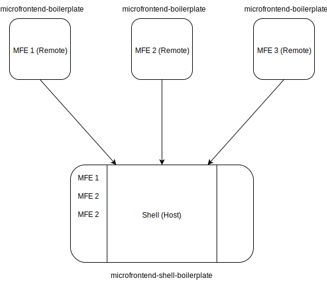

# Microfrontend Shell Boilerplate

This is the Shell application boilerplate project to create microfrontends.

This project follows [JAMStack](https://jamstack.org/) architecture and attempts to follow it's best practices.

 - Fully built with Typescript
 - Designed to integrate with external APIs
 - Isolated functionalities
 - Automated CI/CD with atomic deployments

### Tech Stack

It is based on React / Redux and it is built in Typescript. Bundled with Webpack 5 and enhanced by Babel, ESlint, Prettier, Husky and SCSS.

Includes common React / Redux libraries such as React Router and Redux Saga. It also includes open source libraries @modusbox/react-components and some more.


### What it does

It provides a microfrontend architecture ready to be used, exposing a webpack configuration that exports the microfrontend host able to dynamically import children modules at runtime.

### Setup

This microfrontend setup is configured to have this project acting as the host.

It is responsible to load the children modules/app at runtime and provide them with some context e.g. auth, routing. 

`microfrontend-shell-boilerplate` is a default host(parent) boilerplate meant to consume one or more child microfrontends such as [microfrontend-boilerplate](https://github.com/modusintegration/microfrontend-boilerplate).

Here is a default overview of how the host integrates with the children(remotes).
 - The host provides top-level routing and lazy loads remotes
 - Isolated remotes, developed and released independently from each other, are exposed on a different location


## How to use

### Structure

The file structure is quite similar to a standard module based structure; the only difference with a regular app where all source is bundled, here we are exporting multiple chunks (done automatically by webpack) so that child microfrontends (remotes) will be loaded optimally avoiding the risk of increasing the bundle and importing the same libraries twice.

Folders are modules and include separate files around React views and Redux structure.

#### Available scripts

 - `yarn prettier` to prettify the codebase
 - `yarn lint` to lint the codebase
 - `yarn build` to produce the bundle(s)
 - `yarn serve` to run the production build locally
 - `yarn test` to run the tests

#### Webpack configuration

Enabling code splitting for the microfrontend shell is done using the Webpack _ModuleFederationPlugin_.

The configuration is similar to the following:
```javascript
plugins: [
    new ModuleFederationPlugin({
      shared: [
        'react',
        'react-dom',
        'react-redux',
        'react-router-dom',
        'redux',
        'redux-saga',
        'history',
        '@reduxjs/toolkit',
        '@modusbox/modusbox-ui-components',
      ],
    }),
    ...
```
**Note** We are not specifying the _remotes_ configuration because we are now using _dyanmic lazy loading_.

It is still possible to define static remotes using traditional method

```javascript
plugins: [
  new ModuleFederationPlugin({
    remotes: {
      app: 'app@http://localhost:3002/app.js',
    },
    shared: [...],
  }),
  ...
]
```

#### Loading child modules

There is a React utility module `src/utils/loader` that takes care of dynamic lazy loading of child components, and it also includes some optimization e.g. caching.

It is used as follows:
```javascript
  <Loader
    url="http://localhost:3002/app.js"
    appName="app"
    module="App"
    {...props}
  />
```
There are more usage examples in `App/Microfrontend`.

#### Development setup

Application hosting configuration can be found in `.env`
When working with several host/remote applications it is a requirement that
`PUBLIC_PATH` and `DEV_PORT` are updated to avoid port collision.

```
REACT_APP_API_BASE_URL=/api          // base path for api (could be a URL)
REACT_APP_AUTH_ENABLED=true          // enabled or disables auth
REACT_APP_MOCK_API=true              // necessary to mock api locally
REMOTE_1_URL=http://localhost:3012   // where to load the app 1
DEV_PORT=3001                        // dev only / http port
PUBLIC_PATH=http://localhost:3001/   // dev only, public url, VERCEL_URL used in cloud
```

#### Deployment - In Progress

This boilerplate is currently configured to deploy to [Vercel](https://vercel.com/docs)
using [Vercel for Github](https://vercel.com/docs/git/vercel-for-github)

What is Vercel? Vercel is a cloud platform to deploy frontend applications
onto Vercel's Global Edge Network(CDN).

`microfrontend-shell-boilerplate` can be made to be used with other SPA hosting services.
Just update `webpack.config.js` to pull and set env variables from a hosting service
into `DEV_PORT` and `PUBLIC_PATH`.

```javascript
const { DEV_PORT, VERCEL_URL, PUBLIC_PATH } = process.env;

const config = {
  DEV_PORT,
  PUBLIC_PATH: VERCEL_URL ? `https://${VERCEL_URL}/` : PUBLIC_PATH,
};
```

#### Resources

 - https://webpack.js.org/concepts/module-federation/
 - https://github.com/module-federation/module-federation-examples
 - https://github.com/modusintegration/microfrontend-boilerplate
 - https://jamstack.org/
